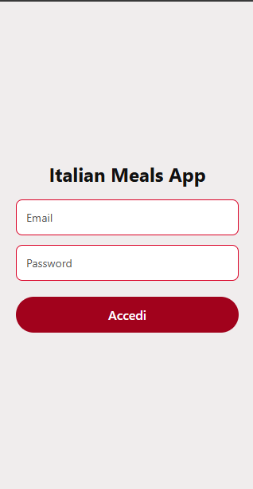
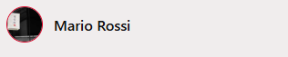
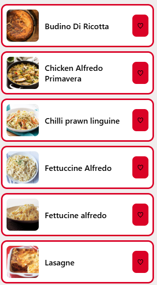
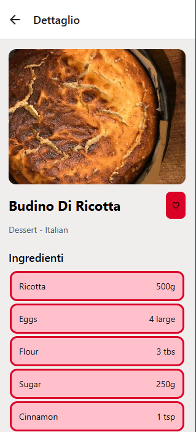
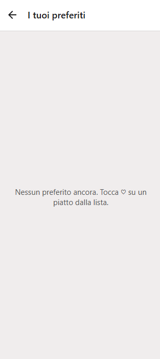
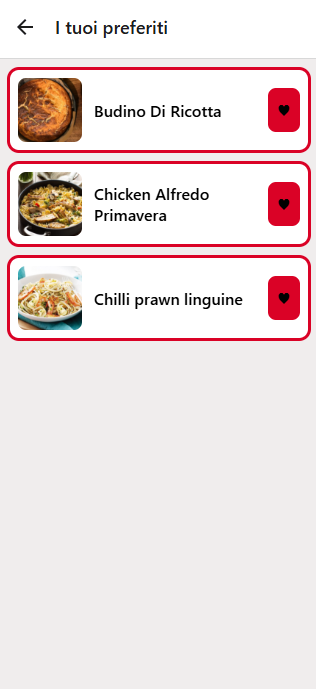
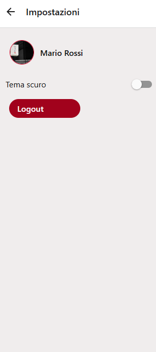
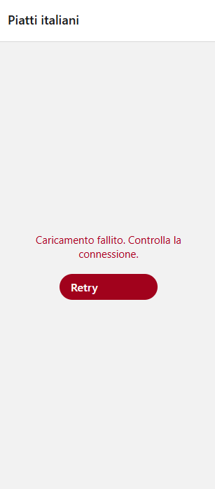
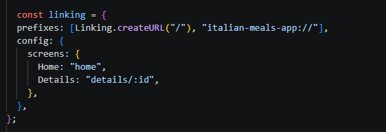

# Progress - Italian Meals App

**Studente:** Alessia Masuzzo
**Repo:** https://github.com/alessiamasuzzo/italian-meals-app
**Ultimo aggiornamento:** 09-07-2026

## Schermate implementate

| Schermata      | Stato | Screenshot                                          |
| -------------- | ----- | ---------------------------------------------------- |
| Login          | ✅    |            |
| Header profilo | ✅    |        |
| Lista piatti   | ✅    |             |
| Dettaglio      | ✅    |       |
| Preferiti      | ✅    |    | 
| Preferiti      | ✅    |    |   |
| Impostazioni   | ✅    |  |
| Errore + Retry | ✅    |           |
| Deep link      | ✅    |     |

## Google Doc (lab 13–19)

**Link:** https://docs.google.com/document/d/1RXdJJVh4GlMYAngYksM9MLcUvdgkYoO3lizdgMCK36Y/edit?tab=t.0#heading=h.wu29v8o1b6lm

Uno screenshot per lab **13–19** (come avete fatto per i lab **01–11** alla verifica intermedia).

| Lab | Contenuto                                | Stato |
| --- | ----------------------------------------- | ----- |
| 13  | Navigazione + parametri route (idMeal)    | ✅    |
| 14  | Deep link meal/:idMeal                    | ✅    |
| 15  | API TheMealDB + loading/error/success     | ✅    |
| 16  | Preferiti in AsyncStorage (app:v1:favs)   | ✅    |
| 17  | Stato globale (Context)                   | ✅    |
| 18  | StyleSheet / Flexbox responsive           | ✅    |
| 19  | Accessibilità e tema                      | ✅    |

## Note

- **Cosa manca per la consegna finale:**
  - Implementare **Ricerca/filtro** sulla lista piatti (`TextInput` controllato, lab 07–11)
  - (Opzionale) feature native lezioni 20–21

## Utenti mock (login di test)

| Email                     | Password    |
| ------------------------- | ----------- |
| mario.rossi@student.it    | React2026!  |
| giulia.bianchi@student.it | Expo2026!   |
| luca.verdi@student.it     | Mobile2026! |
